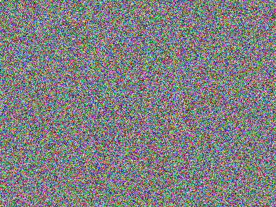
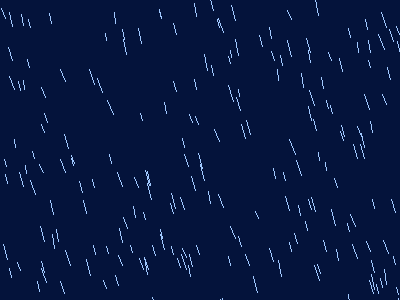

# rusty-drizzle

A basic 2D plain generator using rust

#### AI Disclosure

This project was mostly human written, but AI was also involved for the following things:

- debugging compile errors (e.g., `image`/`getrandom` wasm issues)

- initial project scaffolding (Cargo, wasm-pack setup)

- adding the gif feature into the CLI part

All final commits and decisions were made by a human.

The core logic and design decisions were reviewed and verified by the author

## requirements

you only need those for building from source

- newest version of rust from https://rust-lang.org/tools/install/
- git from https://git-scm.com/install/
- curl

## How to use

#### If you want to to just test it on your webbrowser simply go on 
https://rusty-drizzle.weirdcookie.workers.dev/


If you are on windows go to releases and download the latest .exe


If you are on GNU/Linux paste this command into your terminal emulator to download:

```bash
curl -L -o rusty-drizzle https://github.com/WeirdCookie/rusty-drizzle/releases/download/pre-release/rusty-drizzle && chmod +x rusty-drizzle
```

To start the programm:

```bash
./rusty-drizzle
```

If you want to build the newest code from source:

1. make sure you have all [requirements](#requirements) installed

2. ```bash
    git clone https://github.com/WeirdCookie/rusty-drizzle.git && cd rusty-drizzle && cargo build --release
    ```

3. ```bash
    ./target/release/rusty-drizzle --help
    ```

## Examples

This could be an image of v0.1.0





This could be a gif of v1.0.0




